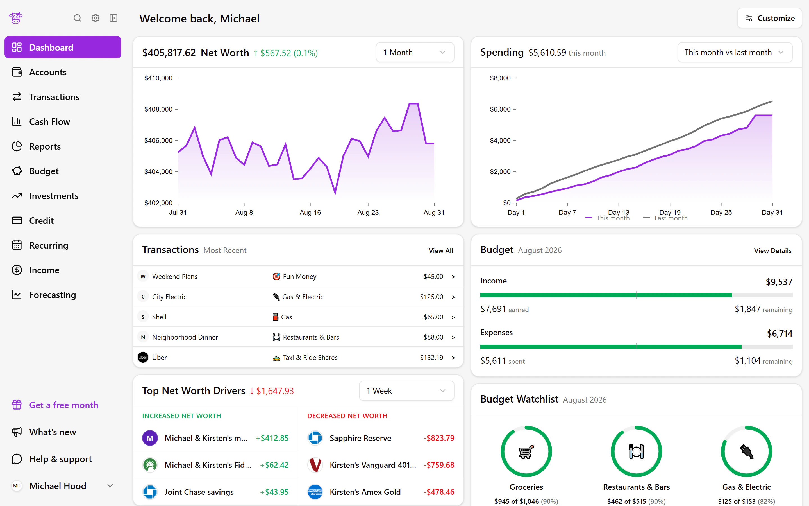
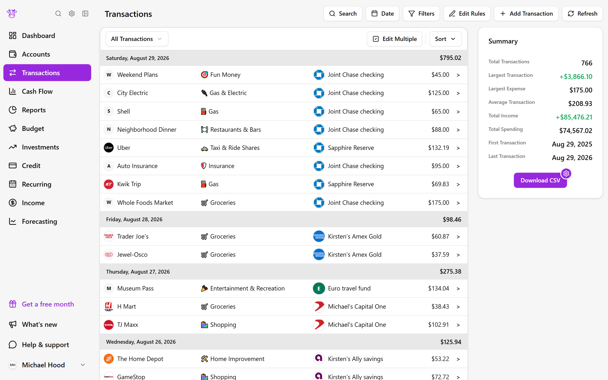
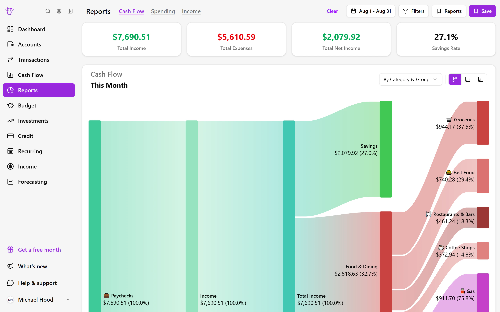

# Moo Money

A clearer view of your money, built for individuals and households.

**[Live product](https://moomoney.net)** · **[Handshake Access presentation](https://www.youtube.com/watch?v=l8JndHK75_M&t=962s)** · **[Engineering decisions](docs/engineering-decisions.md)**

## Why I built it

When I started my first internships, I was earning and managing my own money in a new way. As I opened retirement accounts, I found myself juggling bank accounts, investments, credit cards, and budgets across multiple apps and spreadsheets. Each showed part of the picture, but I wanted to see it all in one place.

I started building the view I wished I had. As it grew, I realized a complete picture should also work for people managing money together while leaving room for what is individual. That personal project became Moo Money.

## What you can do

| Workflow | What Moo Money brings together |
| --- | --- |
| See where you stand | Connected bank, credit, loan, and investment accounts; net-worth history; and property estimates alongside assets and debts. |
| Organize everyday spending | Search across accounts, customize categories and tags, automate categorization with rules, split purchases, and assign transactions for review. |
| Build a budget that fits | Category budgets or fixed, flexible, and non-recurring groups, with progress and selected budget watchlists on the dashboard. |
| Understand what changed | Spending, income, and cash-flow reports, reusable saved views, and configurable transaction exports. |
| Plan for recurring activity | Upcoming income, bills, subscriptions, and credit-card payments in one place. |
| Manage money together | Invite household members with separate logins, see individual and joint accounts together, and filter accounts and transactions by household member. |
| Connect your own tools | Read-only personal API access and webhook notifications for dashboards and automations. |

Follow the [changelog](https://moomoney.net/changelog) for releases and the [roadmap](https://moomoney.net/roadmap) for future work.

## Inside the product

The dashboard above starts with the overall financial picture. The views below let you follow that picture into individual purchases and the flow of income through spending and savings. Screenshots use a fictional demo household and illustrative financial data, captured in August 2026.

<strong>Transactions: organize activity across accounts</strong>

<strong>Reports: follow income through spending and savings</strong>

## My role

I am [Michael Wood](https://www.linkedin.com/in/woodrmichael/), Moo Money's founder and software engineer. I own the product from design and implementation through deployment and ongoing support:

| Area | My work |
| --- | --- |
| Product and UX | Define the product, prioritize feedback, and design financial and household workflows. |
| Web development | Build the public Next.js website and authenticated React/TypeScript application. |
| Backend and data | Build the FastAPI API, business services, database contracts, and household-scoped access. |
| Integrations | Connect financial accounts through Plaid, manage subscriptions through Stripe, and integrate property estimates. |
| Delivery and operations | Maintain deployment workflows, automated checks, monitoring, and ongoing product support. |

## Engineering behind the product

The public website uses **Next.js**; the financial application uses **React, TypeScript, and Vite**. A **Python/FastAPI** backend owns business logic and provider integrations, with **Supabase Auth and PostgreSQL** for identity and data. **Plaid** supplies account connectivity, **Stripe** handles subscriptions, and **RentCast** supplies property estimates.

| Decision | Problem it addresses |
| --- | --- |
| Reconcile a replacement bank connection | Overlapping imports need one-to-one transaction matching while preserving history and user customizations. |
| Model currency precision and missing rates | Household totals need correct rounding, dated conversion rates, and explicit unknown values. |
| Verify live household membership | A valid session alone should not authorize access after household membership changes. |
| Make transaction sync safe to replay | Provider pagination, retries, and pending-to-posted changes must not lose or duplicate financial activity. |
| Treat billing webhooks as stateful processing | Duplicate or out-of-order subscription events must not overwrite newer access decisions. |

The [engineering case studies](docs/engineering-decisions.md) explain these choices, their tradeoffs, and the failure scenarios covered by regression tests.

## Handshake Access 2026

Moo Money was selected as one of four student-built AI projects showcased at Handshake Access 2026 from more than 1,500 Codex Creator Challenge submissions.

I presented Moo Money live to thousands of people, helping the app grow by hundreds of users.

**[Watch the presentation](https://www.youtube.com/watch?v=l8JndHK75_M&t=962s)** · **[Codex Creator Challenge](https://joinhandshake.com/students/codex-creator-challenge/)**
